OperatorPrecedenceParsing
=========================

Esempio
-------

L'operazione di *shift* consiste nel piazzare in cima allo stack degli operatori l'operatore appena letto dalla stringa di input.

L'operazione di *reduce* consiste nel prelevare un operatore dallo stack degli operatori e due(o uno, se l'operatore è unario) operandi dallo stack dei valori. Si esegue l'operazione e il risultato lo si piazza in cima allo stack dei valori.

Si voglia valutare la seguente espressione:

    21 - 8 - 2 * 3 + (6 / 3) + 2^2^3

<table>
    <tr><td>La situazione di partenza è la seguente($ indica le fine dell'input):</td></tr>
    <tr><td>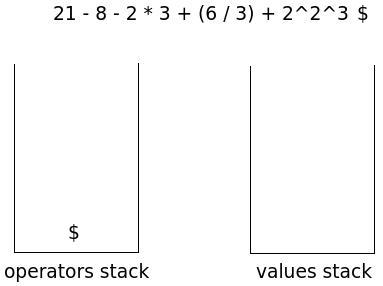</td></tr>
    <tr><td>Il primo token letto dalla stringa di input è il valore 21; lo si piazza in cima allo stack dei valori:</td></tr>
    <tr><td>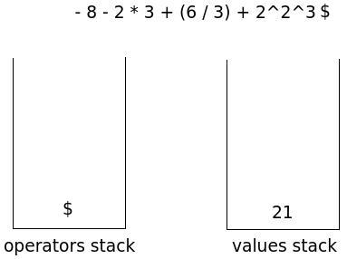</td></tr>
    <tr><td>Il token successivo è l'operatore "-"; si esegue un'operazione di shift:</td></tr>
    <tr><td>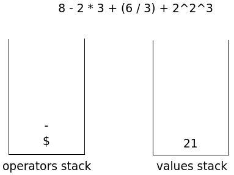</td></tr>
    <tr><td>Il token successivo è il valore 8; lo piazziamo in cima allo stack dei valori:</td></tr>
    <tr><td>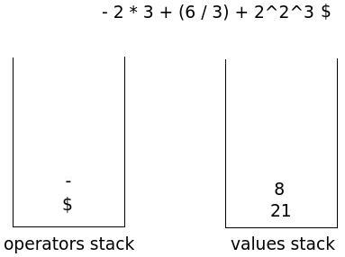</td></tr>
    <tr><td>Il token successivo è l'operatore "-"; lo confrontiamo con l'operatore in cima allo stack degli operatori, "-". hanno uguale precedenza; eseguiamo un'operazione di reduce perché l'operatore "-" è associativo a sinistra:</td></tr>
    <tr><td>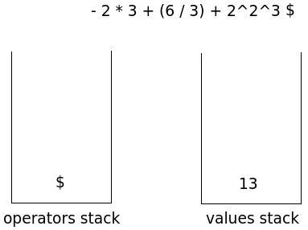</td></tr>
    <tr><td>L'operatore "-" viene shiftato:</td></tr>
    <tr><td>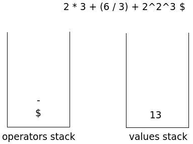</td></tr>
    <tr><td>Piazziamo il token successivo, il valore 2, nello stack dei valori:</td></tr>
    <tr><td>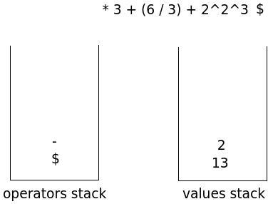</td></tr>
    <tr><td>Il token successivo, l'operatore "*" ha precedenza maggiore di quello che si trova in cima allo stack degli operatori, "-", e quindi va shiftato:</td></tr>
    <tr><td>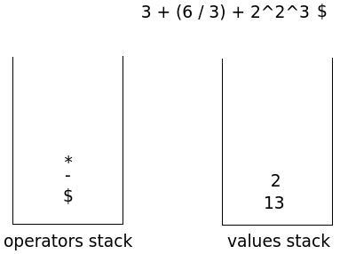</td></tr>
    <tr><td>Il valore 3 viene piazzato in cima allo stack dei valori:</td></tr>
    <tr><td>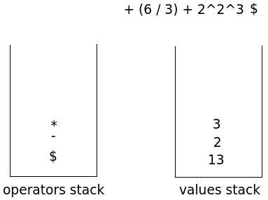</td></tr>
    <tr><td>Il token successivo, l'operatore "+", ha precedenza minore rispetto a quello che si trova in cima allo stack degli operatori, "*", e quindi eseguimo un'operazione di reduce:</td></tr>
    <tr><td>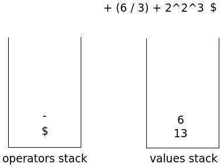</td></tr>
    <tr><td>Il confronto fra i due operatori, adesso, si traduce in un'operazione di reduce(precedenza uguale ma l'operatore "-", in cima allo stack degli operatori, è associativo a sinistra):</td></tr>
    <tr><td>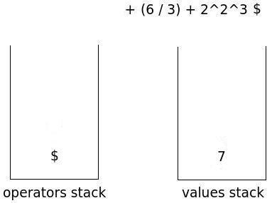</td></tr>
    <tr><td>L'operatore "+" viene shiftato. La parentesi aperta viene shiftata:<td></tr>
    <tr>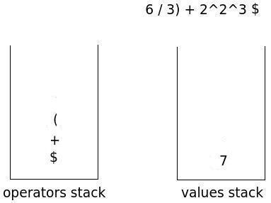</tr>
    <tr><td>Il valore 6 viene piazzato in cima allo stack degli operatori:</td></tr>
    <tr><td>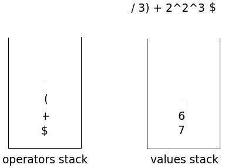</td></tr>
    <tr><td>L'operatore "/" viene shiftato:</td></tr>
    <tr><td></td></tr>
    <tr><td>Il token successivo, nella stringa di input, è la parentesi chiusa. Si procede ripetutamente a un'operazione du reduce, finché non incontriamo, in cima allo stack degli operatori, la parentesi aperta:</td></tr>
    <tr><td>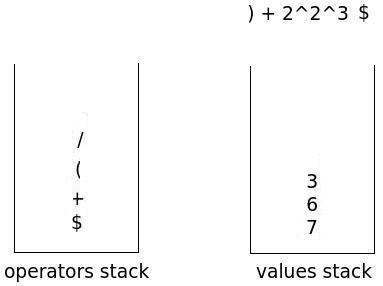</td></tr>
    <tr><td>Le due parenesi vengono scartate:</td></tr>
    <tr><td>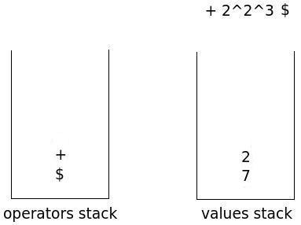</td></tr>
    <tr><td>L'operazione successiva è una reduce(operatori uguali, associatività a sinistra):</td></tr>
    <tr><td>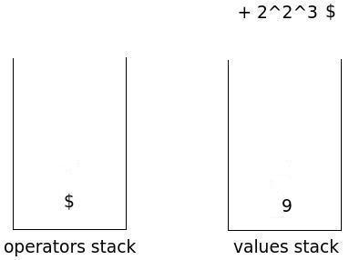</td></tr>
    <tr><td>L'operatore "+" viene shiftato:</td></tr>
    <tr><td>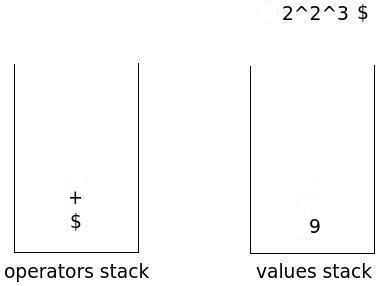</td></tr>
    <tr><td>Il valore 2 viene piazzato in cima allo stack degli operatori:</td></tr>
    <tr><td>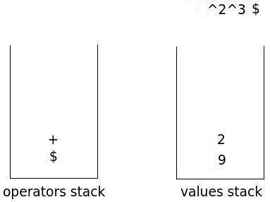</td></tr>
    <tr><td>Il token successivo, l'operatore "^" ha prededenza maggiore rispetto a quello in cima allo stack degli operatori, "+". Si procede quindi a un'operazione di shift:</td></tr>
    <tr><td>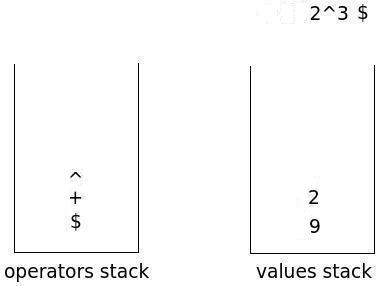</td></tr>
    <tr><td>Il valore 2 viene piazzato in cima allo stack dei valori:</td></tr>
    <tr><td>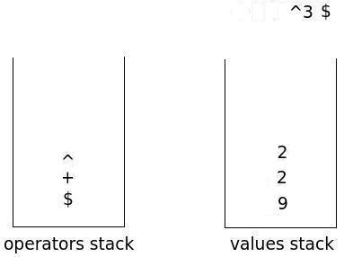</td></tr>
    <tr><td>Il token successivo, l'operatore "^" è uguale a quello in cima allo stack degli operatori. L'operatore "^" è associativo a destra e si procede, quindi, a un'operazione di shift:<td></tr>
    <tr><td>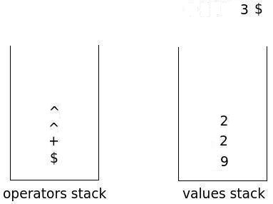</td></tr>
    <tr><td>Il valore 3 viene piazzato in cima allo stack dei valori:</td></tr>
    <tr><td>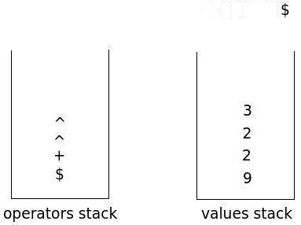</td></tr>
    <tr><td>Siamo giunti alla fine della stringa di input. Eseguiamo ripetutamente l'operazione di reduce finché lo stack degli operatori contiene, in cima, il simbolo di fine input, $:</td></tr>
    <tr><td>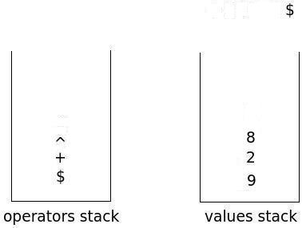</td></tr>
    <tr><td>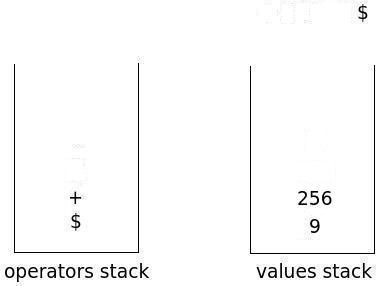</td></tr>
    <tr><td>Adesso lo stack dei valori contiene un solo valore, il risultato dell'espressione:</td></tr>
    <tr><td>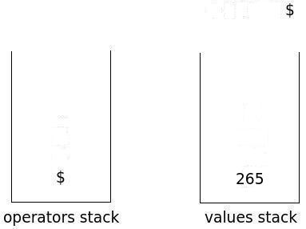</td></tr>
</table>
