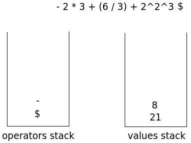
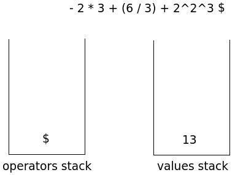
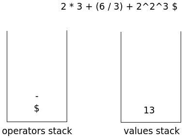
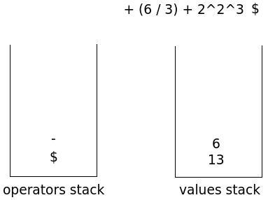
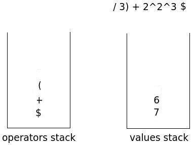
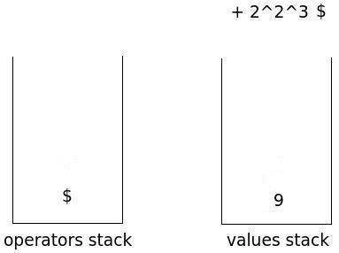

OperatorPrecedenceParsing
=========================

Example
-------

The *shift* operation is to push on operators stack, the operator just read from the input string.

The *reduce* operation consists in popping one operator from the operators stack and two (or one, if the operator is unary) operands from the values stack. It performs the operation and the result is pushed on values stack.

You want to evaluate the following expression:

    21 - 8 - 2 * 3 + (6 / 3) + 2^2^3

The initial situation is as follows($ indicates the end of input):
  

The first token read from the input string is the value 21; push it on values stack:
  

The next token is the "-" operator; performing a shift:
  

The next token is the value 8; push it on values stack:
  

The next token is the "-" operator, we compare it with the operator at the top of the stack of operators, "-". have equal precedence; perform a reduce operation because the "-" operator is left associative:
  

Shift "-" operator:
  

Push value 2 on values stack:
  

The next token, the "*" operator has higher precedence than what is located in top of the stack of operators, "-", and then goes shifted:
  

Value 3 is pushed into values stack:
  

The next token, the operator "+", has lower precedence than the one that is located in top of the stack of operators, "*", and then execute a reduce operation:
  

The comparison between the two operators, now, is reflected in an operation to reduce (equal precedence but the "-" operator, on top of the operators stack, is left associative):
  

The "+" operator is shifted. The open parenthesis is shifted:
  

Value 6 is pushed on values stack:
  

The "/" operator is shifted:
  

The next token in the input string, is the closing parenthesis. We proceed to a reduce operation repeatedly, until we meet, on top of the operators stack, the open parenthesis:
  

The two parenthesis are discarded:
  

The next step is a reduce operation (equal operators, left associativity):
  

The "+" operator is shifted:
  

Value 2 is pushed on values stack:
  

The next token, the operator "^" has prededenza greater than that in the top of the stack of operators, "+". It then is shifted:
  

Value 2 is pushed on values stack:
  

The next token, the operator "^" is equal to the top of the operators stack. The "^" operator is right-associative and then proceeds to an operation of shift:
  

Value 3 is pushed on values stack:
  

We reached the end of the input string. Repeatedly perform the task of reducing until the operators stack contains, at the top, the end-of-input symbol, $:
  

  

Now the value stack contains only one value, the result:
  
